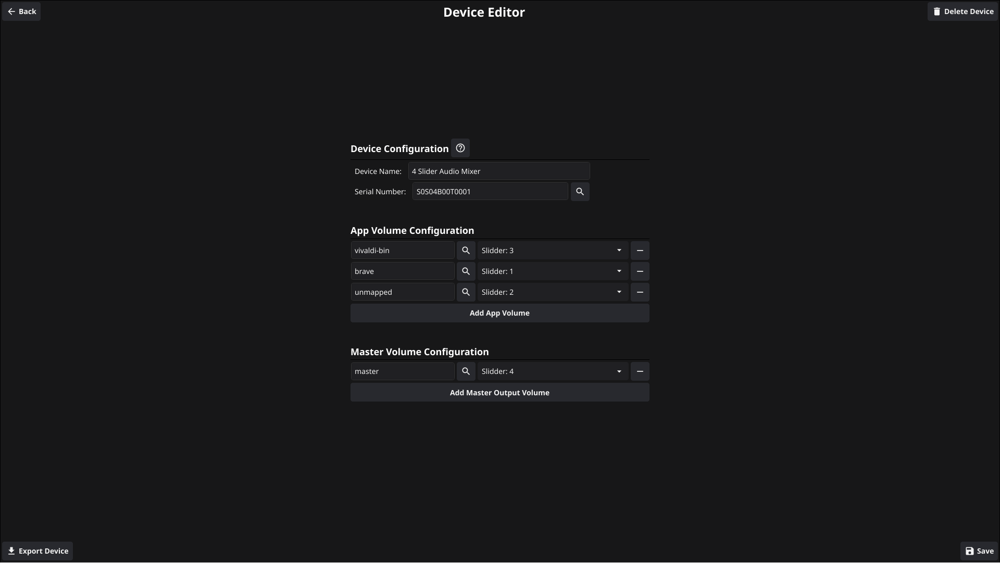

 

 

MixMaster is a hardware + software tool that lets you control the audio and playback of different applications on your Linux computer using a microcontroller. Adjust volumes, play, skip, and manage multiple apps—all from a single physical device.

## Features
- Control the volume of individual applications in real-time
- Play, pause, and skip tracks across supported apps
- Works through a microcontroller plugged into your computer
- Designed for Linux systems (currently does **not** support Windows or macOS)
- Support for control over serial to allow many different micro controlers to Work
- Support for control over HID for a more robust connection with using the ATmega32U4 Microcontroller

## Images
Main Screen for the app:
 

Device Configuration Screen:
 

## Requirements
- Linux with pulse audio
- Microcontroller (e.g., Arduino) connected via USB/COM port

## Usage
1. Connect your microcontroller to your Linux computer
2. Configure the device using the MixMaster App
3. Start making you audio experience better

## Contributing
Contributions are welcome! If you want to help develop MixMaster, feel free to submit issues or pull requests.
